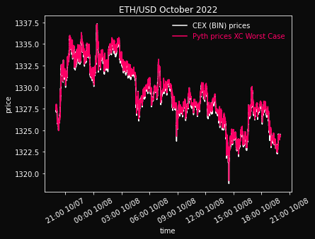
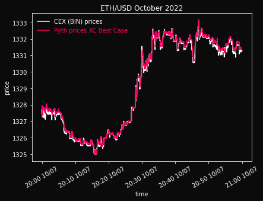
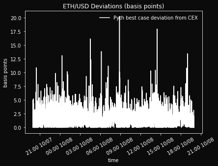
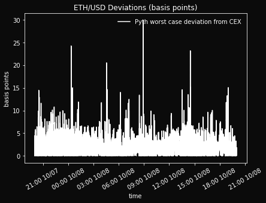
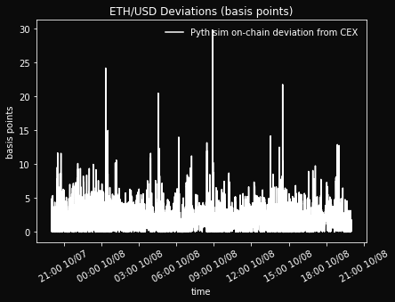
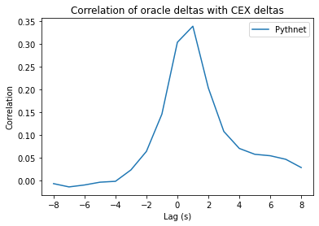
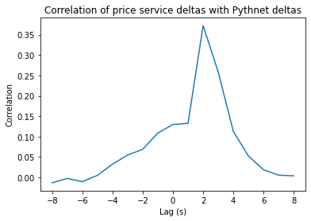

## Simple Summary

<!--"If you can't explain it simply, you don't understand it well enough." Simply describe the outcome the proposed changes intends to achieve. This should be non-technical and accessible to a casual community member.-->

This SIP proposes the integration of Pyth Network oracles with Synthetix Perps v2 contracts.

## Abstract

<!--A short (~200 word) description of the proposed change, the abstract should clearly describe the proposed change. This is what *will* be done if the SIP is implemented, not *why* it should be done or *how* it will be done. If the SIP proposes deploying a new contract, write, "we propose to deploy a new contract that will do x".-->

As outlined in [SIP-279](https://sips.synthetix.io/sips/sip-279/), there is a desire in the Synthetix community to for oracles with off-chain prices with on-chain validity/recency verification. Pyth Network is well-positioned to fulfill this need and help Synthetix Perps support high performance UX and more competitive pricing. 

## Motivation

<!--This is the problem statement. This is the *why* of the SIP. It should clearly explain *why* the current state of the protocol is inadequate.  It is critical that you explain *why* the change is needed, if the SIP proposes changing how something is calculated, you must address *why* the current calculation is inaccurate or wrong. This is not the place to describe how the SIP will address the issue!-->

Pricing exchanges using purely on-chain oracles suffers from significant inefficiencies/limitations. Price feeds that can update in higher performance environments, but whose validity/recency can be verified on-chain offer a useful tradeoff for oracle-reliant protocols. 

Pyth Network is an oracle provider that publishes financial market data to multiple blockchains. Our market data is contributed by over 70 [first-party data providers](https://pyth.network/publishers/), including some of the biggest exchanges and market making firms in the world. The oracle offers price feeds for a number of different asset classes, including [US equities, commodities, and cryptocurrencies](https://pyth.network/price-feeds/).

The oracle’s price feeds are designed to be fast, accurate and reliable. Price feeds update multiple times per second — you can see [live price updates](https://pyth.network/price-feeds/?cluster=pythnet) on the [pyth.network](http://pyth.network) website. Each price update is a robust aggregate of multiple data providers’ reported prices. The oracle uses a [robust aggregation](https://docs.pyth.network/how-pyth-works/price-aggregation) procedure to guarantee that a small number of colluding (or simply accidentally incorrect) providers cannot substantially influence the aggregate price. Feeds are also reliable due to the redundancy between providers.

Pyth Network runs on its own appchain called Pythnet, and delivers prices to other blockchains via the [Wormhole interoperability protocol](https://wormhole.com/). Pyth Network provides a price service that allows anyone to listen for these messages via an HTTP or Websocket API. 

## Specification

### Overview

<!--This is a high level overview of *how* the SIP will solve the problem. The overview should clearly describe how the new feature will be implemented.-->  

Integrating with Pyth Network on Optimism is straightforward, though slightly different from other oracles. Pyth Network has a contract deployed on Optimism from which any on-chain application can read the current value of any price feed. However, Pyth Network uses *on-demand price updates:* Pyth Network does not continuously update the on-chain state of each price feed. Instead, the Pyth Network contract supports a permissionless price update operation that anyone can invoke. This operation takes a Wormhole message, verifies its contents, then updates the on-chain state. The intent of this design is that anyone who needs a Pyth Network price for a transaction can simply update the price in the same transaction (i.e., right before using it). 

Thus, integrating with Pyth Network has two steps:

1. The on-chain contract reads prices from the Pyth Network contract.
2. Any application that sends transactions to the on-chain contract — e.g., a web frontend — needs to simultaneously send a Pyth price update. This update can be retrieved from the Pyth Network price service (which simply relays it from Wormhole’s peer-to-peer network).
3. (Optional) Integrators may choose to host their own instance of the price service for resilience.

The Pyth Network SDKs help integrators with both of these steps. An example frontend and contract integration is shown here in the [javascript SDK](https://github.com/pyth-network/pyth-js/tree/main/pyth-evm-js#quickstart). 

One noteworthy aspect of the integration is handling stale prices. Integrators can set a recency threshold that fails the transaction if the on-chain Pyth Network price is from too far in the past. This threshold guards against potentially malicious behavior where attackers try to use stale prices. The SDK provides a default threshold, but integrators can tune the threshold to suit their use case; e.g., highly latency-sensitive protocols can use a smaller threshold.

### Rationale

<!--This is where you explain the reasoning behind how you propose to solve the problem. Why did you propose to implement the change in this way, what were the considerations and trade-offs. The rationale fleshes out what motivated the design and why particular design decisions were made. It should describe alternate designs that were considered and related work. The rationale may also provide evidence of consensus within the community, and should discuss important objections or concerns raised during discussion.-->

To assess the potential benefits of this proposal, we evaluate Pyth under three different sets of assumptions:

1. a **best case** scenario where we assume no latency between prices arriving at the price service and those prices appearing on-chain. This scenario represents the ideal on-demand setting, where users always submit the most recent Pyth price update with their transaction.  
2. a **worst case** scenario where we assume a maximum possible latency of 15 seconds between prices arriving at the price service and those prices appearing on-chain. This scenario represents the worst-case on-demand setting, where the recency threshold is set to 15 seconds (~one block time), and every user is behaving adversarially.
3. a realistic **simulated** scenario where an off-chain crank pushes the price on-chain every 15 seconds (~one block time), with no on-demand updates. (Note that a real implementation with a crank would likely perform better than this simulation, as there would *also* be on-demand updates.)

Our analysis considers the period between Friday, October 7, 2022 8:00:00 PM and Saturday, October 8, 2022 8:00:00 PM (all UTC). We focus on these 24 hours because during this period, we could easily assess the Pyth price feed according to the loose criteria mentioned above (15-secondly crank pull, no on-demand updates). During this period, the Pythnet feed updated and sent out a Wormhole VAA 97,553 times (on average once every 0.887 seconds). For the centralized exchange (CEX) reference point for prices to evaluate the accuracy and latency of Pyth prices, we use the extremely liquid Binance ETH/USDT price feed.

**Price Charts**

As a first step, we plot the Pyth and CEX prices for the full 24 hours. The following plots show that the oracle price feeds generally follow the CEX price feed with a bit of lag—as can be seen in the instances where the CEX price slightly precedes the oracle price.

*10/7 8:00 PM - 10/8 8:00 PM. During this subperiod, Pyth best case avg. deviation is $0.19 (1.4 bps).*

*10/7 8:00 PM - 10/8 8:00 PM. During this subperiod, Pyth worst case avg. deviation is $0.25 (1.9 bps).*

*10/7 8:00 PM - 10/8 8:00 PM. During this subperiod, Pyth simulated case avg. deviation is $0.22 (1.6 bps).*

This macro perspective doesn’t show the details of price movement and following particularly well, so we zoom in on a 1-hour interval (10/7 8:00 PM to 9:00 PM) with high price volatility to demonstrate how the Pyth prices update very frequently and track the CEX price extremely closely. (Note that the CEX price series appears to be slightly offset from the Pyth price. This offset is largely due to the difference between USD and USDT: the Pyth price feed represents ETH/USD whereas Binance offers ETH/USDT).

*10/7 8:00 PM - 10/9 9:00 PM. During this subperiod, Pyth best case avg. deviation is $0.16 (1.2 bps).*

*10/7 8:00 PM - 10/9 9:00 PM. During this subperiod, Pyth worst case avg. deviation is $0.27 (2.1 bps).*

*10/7 8:00 PM - 10/9 9:00 PM. During this subperiod, Pyth simulated case avg. deviation is $0.22 (1.6 bps).*

**Deviations**

The following charts show the difference between the Pyth Network price and the CEX price, expressed in basis points (1 basis point is 1/100th of 1 percent). 

We can also summarize the content of the above charts across time in tabular format. The following table shows the average, median, and 95th percentile of the deviations for the different cases.

**Latency**

We can estimate the latency of Pyth Network prices relative to the CEX by taking the deltas of the price feed (i.e. $p_{t+1} - p_t$) at the price service level and checking the correlation of the oracle deltas with the CEX deltas at different lags. The lag at which we observe the optimal correlation is one way of estimating the latency introduced by the oracle itself. In the case of the 24-hour dataset of relevance, the plot below shows that the price at the price service API has an optimal correlation with the CEX price at a lag of around 3 seconds. This firmly indicates that the Pyth feed when it arrives at the price service API exhibits about 3 seconds of latency relative to Binance.

To obtain a more granular breakdown of the latency, we can also examine the optimal correlation and lag between the CEX and Pythnet and between Pythnet and the price service. Intuitively, we should observe that

$$
Lag^*_{\text{CEX}, \text{Price Service}} \approx Lag^*_{\text{CEX}, \text{Pythnet}} + Lag^*_{\text{Pythnet}, \text{Price Service}}
$$

where $Lag^*_{a,b}$ indicates the optimal lag—i.e. that lag that produces the max correlation—between price feeds at $a$ and $b$. We therefore plot the correlation as a function of lag 1) between CEX and Pythnet and 2) between Pythnet and the price service. We find that the optimal lag is 1 second for CEX-to-Pythnet and 2 seconds for Pythnet-to-price service. This indicates that the Pythnet prices exhibit about 1 second of latency relative to Binance and that there is about 2 seconds of latency (introduced by Wormhole) to get to the price service. Moreover, this is consistent with our lag estimate of about 3 seconds for CEX-to-price service.

### Technical Specification

<!--The technical specification should outline the public API of the changes proposed. That is, changes to any of the interfaces Synthetix currently exposes or the creations of new ones.-->

Given the resolution of timestamp updates on Optimism as well as the intrinsic latency of Pyth Network price updates, the most practical implementation would likely utilize asynchronously settled orders (proposed in [SIP-281](https://sips.synthetix.io/sips/sip-281/)) where:

1) user queues market order

2) configurable delay threshold elapses 

3) keeper retrieves most recent Pyth Network price update off-chain

4) keeper updates Pyth oracle price on-chain and confirms user’s order 

Note that Synthetix contracts would enforce that ΔT between (1) and (4) is sufficiently delayed. Delay thresholds can be configured via SCCP, but would likely be set to 12 seconds initially (equal to Ethereum L1 block time). In other words, the off-chain timestamp from the price update used to confirm the order must be during the L1 block epoch immediately after the order was queued, **which results in an average realized delay of 6 seconds**. In the future when L2 blocks have more resolved timestamps, this delay threshold can likely be shortened considerably. 

While 6 second settlement is far from optimal, it is a substantial UX improvement over next-price orders in Synthetix Perps v1 with a clear path to future improvements. Additionally delayed orders using Pyth Network price updates are highly resilient to latency arbitrage, which can help support extremely competitive spreads/fees. This SIP proposes an initial test integration with a single perps market (ETH-PERP), which can potentially be expanded via SCCP at a later point in time. 

### Test Cases

N/A

### Configurable Values (Via SCCP)

N/A

## Copyright

Copyright and related rights waived via [CC0](https://creativecommons.org/publicdomain/zero/1.0/).