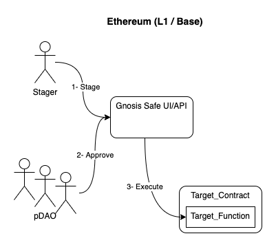
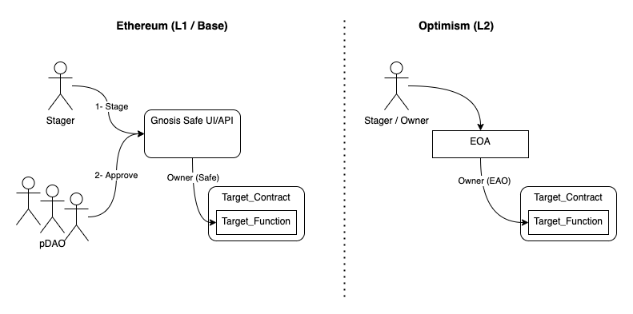

<!--You can leave these HTML comments in your merged SIP and delete the visible duplicate text guides, they will not appear and may be helpful to refer to if you edit it again. This is the suggested template for new SIPs. Note that an SIP number will be assigned by an editor. When opening a pull request to submit your SIP, please use an abbreviated title in the filename, `sip-draft_title_abbrev.md`. The title should be 44 characters or less.-->

## Simple Summary

<!--"If you can't explain it simply, you don't understand it well enough." Simply describe the outcome the proposed changes intends to achieve. This should be non-technical and accessible to a casual community member.-->

Add the ability to govern L2 contracts with a MultiSig (Gnosis Safe) contract instead of using EOA.

## Abstract

<!--A short (~200 word) description of the proposed change, the abstract should clearly describe the proposed change. This is what *will* be done if the SIP is implemented, not *why* it should be done or *how* it will be done. If the SIP proposes deploying a new contract, write, "we propose to deploy a new contract that will do x".-->

This SIP proposes the addition of a bridge to connect L2 contracts to an L1 Gnosis Safe. The bridge will allow the government council to authorize actions on L2 contracts using the same mechanism used on L1.

## Motivation

<!--This is the problem statement. This is the *why* of the SIP. It should clearly explain *why* the current state of the protocol is inadequate.  It is critical that you explain *why* the change is needed, if the SIP proposes changing how something is calculated, you must address *why* the current calculation is innaccurate or wrong. This is not the place to describe how the SIP will address the issue!-->

Currently L2 contracts are owned by EAO which poses a risk on ownership and security. The proposed SIP allows a contract or multisig to own L2 contracts and enable proper council governance.

## Specification

<!--The specification should describe the syntax and semantics of any new feature, there are five sections
1. Overview
2. Rationale
3. Technical Specification
4. Test Cases
5. Configurable Values
-->

### Overview

<!--This is a high level overview of *how* the SIP will solve the problem. The overview should clearly describe how the new feature will be implemented.-->

The proposed solution is to add a bridge contract that will act as liaison between a Gnosis Safe in L1 and the contracts on L2 so that all operations (ownership authorizations on L1 and L2) are done by the council using the same network and known tools.

### Rationale

<!--This is where you explain the reasoning behind how you propose to solve the problem. Why did you propose to implement the change in this way, what were the considerations and trade-offs. The rationale fleshes out what motivated the design and why particular design decisions were made. It should describe alternate designs that were considered and related work. The rationale may also provide evidence of consensus within the community, and should discuss important objections or concerns raised during discussion.-->

During the previous discussions we identified three different options to provide governance on L2 each with its own pros and cons that are shown below.

- **Gnosis Safe in L1 and Gnosis Safe in L2**

  Pros: Same proven mechanism as in L1.

  Cons: Not yet _officially_ available (there are some forks); will require Governance council to connect to both networks.

- **Gnosis Safe in L1 and Legacy Multisig in L2**

  Pros: Easy to implement.

  Cons: Using a Legacy multisig that is not supported by gnosis (there is a working project adapting it to L2); will require Governance council to connect to both networks and use different tools.

- **Gnosis Safe in L1 and Ownership Bridge in L2**

  Pros: Using a single tool to L1 and L2 (Gnosis Safe on L1).

  Cons: Authorizations on L2 will take time due to the bridge propagation process.

From the three options the chosen one is the 3rd that, based on Gnosis Safe in L1 to do all the authorizations (L1 and L2), will simplify the operations. It requires the addition of a bridge (based on [this CrossChainAccount technique](https://github.com/gakonst/xchain-account/blob/master/contracts/CrossChainAccount.sol)).

### Technical Specification

<!--The technical specification should outline the public API of the changes proposed. That is, changes to any of the interfaces Synthetix currently exposes or the creations of new ones.-->
TL/DR: 
The proposal includes the creation of two new governance contracts that will act as bridges (OwnerRelayOnEthereum.sol and OwnerRelayOnOptimism.sol) and link the ownwership from L1 to L2.
**OwnerRelayOnEthereum** is owned by the gnosis safe contract, the staged transations on Safe are directed to that contract and encoded with the appropriate data and target to interact with the appropriate contract on L2. Once signed and executed by the pDAO, it will automatically relay to **OwnerRelayOnOptimism** on L2, that is the L2 contracts owner, and will execute the commands (as owner) on behalf of the pDAO to transact on Optimism (L2)

#### Current process on Ethereum

Ownership protected contracts on Ethereum are owned by a Gnosis Safe contract. The process of signing and executing a transation on the protected contracts involves the stage of a transaction and the later approval from the pDAO and its execution. 

#### Current process on Optimism

Ownership protected contracts on Optimism, on the other side, are owned by a EOA (Externally Owned Account), and hence, to sign and execute a transaction on Optmimism right now requires only that somebody with the verbal authorization from the pDAO and the right key executes the transaction.

As can be seen in the following image, optmimism contracts are more susceptible to security (based on ownership) issues and lacks the on-contract approval process.

#### Bridged process on Optimism

In order to solve the issues of the current the proposal is to add a couple of contracts (one on each network, Ethereum and Optmism or L2) that will be used as a bridge and link Gnosis Safe to L2 named **OwnerRelayOnEthereum** and **OwnerRelayOnOptimism**.
**OwnerRelayOnEthereum** will be installed in Etherum and will be owned by the Gnosis Safe contract. It will relay the transactions data to its counterpart contract on Optimism (L2), named OwnerRelayOnOptimism. **OwnerRelayOnOptimism** will be the owner of the owned protected contracts on L2 so that the same protection (and same mechanism to sign transactions) that exists on Ethereum are present on Optimism. 

The bridged governance solution proposed is based on [CrossChainAccount technique](https://github.com/gakonst/xchain-account/blob/master/contracts/CrossChainAccount.sol).

The setup comprises installing the two new contracts (one per network), link them and transfer the ownership of protected contracts on L2 to the relay on optmis.

The following image shows the process to sign a transaction on L2, it can be splitted in the following steps:

- *1- Stage.* One CC will stage the transaction on the Gnosis safe UI/API with the encoded data to be executed on the target L2 contract. He will communicate to the pDAO representatives and ask them to sign the transaction. 
- *2- Approve.* Once the minumun number of approvals are reached on gnosis safe, the transaction can be executed.
- *3- Execute.* The execution means the Gnosis Safe will execute the approved transaction on the **OwnerRelayOnEthereum** contract. Up to this point the process was simmilar to the one on Ethereum.
- *4- Relay.* This step is split in two (4.1 and 4.2). 
  -  *4.1- Relay L1.* The L1 part of the relay consist on sending a transaction to the Optimism Messenger from Ethereum network that will relay it to the optimism network. The target for this transaction is the our relay cuonterpart on L2 (OwnerRelayOnOptimism).
  - *4.2- Relay on L2.* After 5 to 8 minutes, when the transaction is relayed by the optimism messenger to Optimism Network, the transaction will be received by OwnerRelayOnOptimism. 
- *5- Execute.* This is actually the execution of the staged transaction on gnosis Safe, but on a protected contract on L2. 

As it can be seen on the descriptions, the first steps (human involved process, from 1 to 3) are the same for signing transactions on L1 and L2, the only difference is on how to set the data and target on the staged transaction. The rest of the process is fully automated.

### Test Cases

<!--Test cases for an implementation are mandatory for SIPs but can be included with the implementation..-->

#### Unit Tests

Two new unit test added to test both contracts. Those unit tests will mock the required external interfaces (i.e. opt messenger). Those tests needs to cover, for both contracts:
- Assert the interface is the expected

For OwnerRelayOnEthereum
- It reverts transactions coming from a non-owner address
- It can initiate a relay transaction to L2
- It emits an event when the transaction is relayed to the Opt. Messenger
- The data, target relayed are right
- The CrossDomainGasLimit is set to the desired value
- The CrossDomainGasLimit is set to the DEFAULT value is set to 0

For OwnerRelayOnOptimism
- It reverts transactions coming not comming from the Opt. Messenger
- It reverts transaction originated on a different address on L1 (not OwnerRelayOnEthereum)
- It can accept ownership on the target contracts on L2 
- It can finalize a relay transaction from L1
- An event is emmited
- The data, target relayed are right

#### Integration Tests

One integration test to cover the relay. Using SystemSettingsL2 as target contract on L2 and updating a setting (minimumStakeTime)
- Transfer ownership of the L2 target contract (using SystemSettingsL2) to OwnerRelayOnOptimism if still owned by an EOA.
- Try to update a setting on the target contract on L2 using a transaction initiatied in L1 (we are not using a gnosis safe account as owner of OwnerRelayOnEthereum, but an EOA) and revert the change to the original value.
- Relinquish ownsership of the target contract and transfer it back to a EOA.

#### Manual Tests

- Test on Kovan using fresh instances.
- Deploy and test on mainnet.

### Configurable Values (Via SCCP)

<!--Please list all values configurable via SCCP under this implementation.-->

N/A at the moment of writing this SIP.

## Copyright

Copyright and related rights waived via [CC0](https://creativecommons.org/publicdomain/zero/1.0/).
